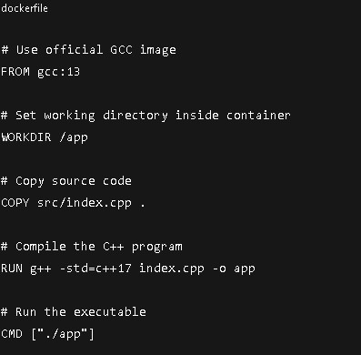

# Simple-CPP-Docker :whale2:
A simple C++ application containerized using Docker.
The program prints the current date and time when run inside a Docker container.
This project is intended as a minimal example to demonstrate:
* Writing a basic C++ program
* Building it with GCC inside Docker
* Running the compiled binary in a container

## :open_file_folder: Project Structure
*SimpleCPPDocker/
      *Dockerfile
           *src/
                *index.cpp

## :page_with_curl: Source Code (index.cpp)
The C++ program prints the current system date and time using standard libraries.
Key features:
* <chrono> - modern C++ way to get the current time.
* <ctime> - format that time into something human-readable.
* Compatible with C++17
* No external dependencies

## Dockerfile Overview :whale2:
The Dockerfile:
* Uses the official GCC image
* Copies the source code into the container
* Compiles the C++ program
* Runs the executable on container start

Dockerfile Explaination

